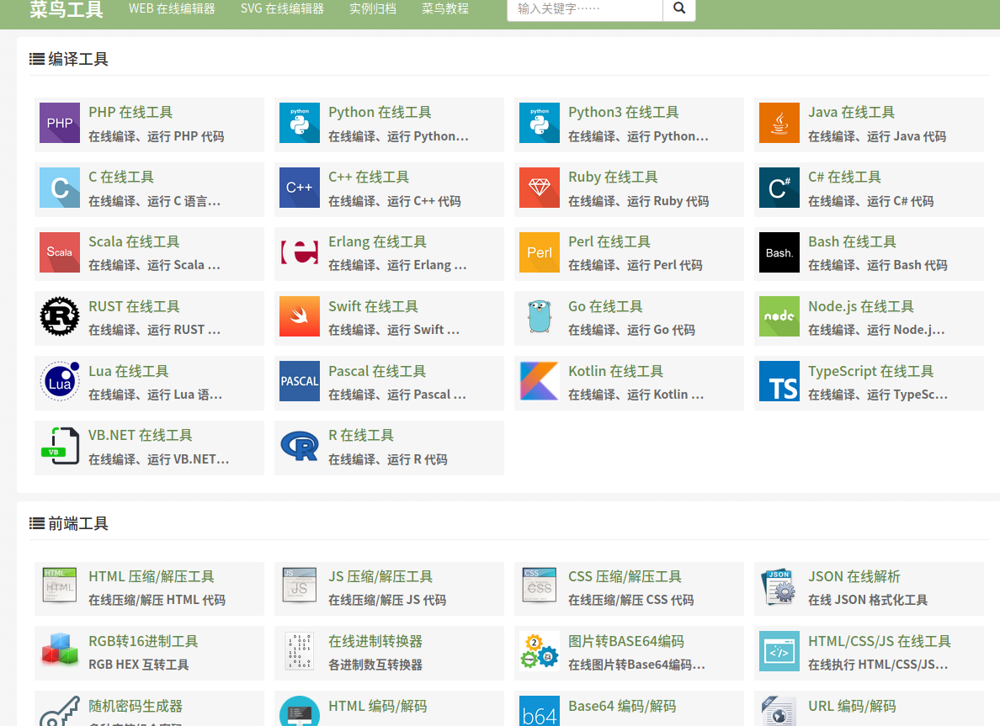

# Useful_Website 一些优秀的网站总结

list some very useful and cool website ) (**持续更新中**)

[TOC]

## 1. 图片壁纸素材类网站

- [unsplash](https://unsplash.com/)  
真正免费高质量照片网站，照片都是真实的摄影，照片分辨率也很大，用来做网页素材已经足够，网站每10天更新10张照片，差不多每天一更了，值得设计师们收藏。可以从该网站寻找适合做壁纸的图片。

- [Pexels](https://www.pexels.com/)  
所有支持下载的图片你都可以自由使用，免费用于商业用途！

- [wallpaperwide](http://wallpaperswide.com/) 

  一个壁纸网站，种类很多，壁纸不是非常的多，但够用了。重点是，该网站的壁纸无水印，且可以任意选择壁纸的尺寸，尺寸规则种类非常多。

- [remixicon](https://remixicon.com/) **图标库** 

  一个图标素材网站，提供多种尺寸，格式下载，也支持前端引用。github上有其repo。
  
- [ikonate](https://ikonate.com/) **图标库（推荐）**  

  另一个图标库，可以自定义图标颜色并下载。
  
  
## 2. 工具类网站

- [菜鸟工具-在线画图](https://c.runoob.com/more/shapefly-diagram/)

  菜鸟教程的在线画图的网址，无需登陆，可以创建多个文件，可以下载到本地，可以导入文件打开。发现的唯一缺点就是：不能复制选中的图案。

- [processon在线画图](https://www.processon.com/) **（推荐）**

  非常好用的在线画图网站，需要登录（可以国内的社交软件账户授权登录），计算机资源图较多，图形分类多。非常适合来画架构图，还有社区可以观看，复制或者购买别人做的各种图，种类繁多，支持搜索。而且相比于菜鸟的在线画图，processon支持复制粘图形。

- [whimsical](https://whimsical.com/)

  网站页面非常好看的在线画图的网站，画图的种类不多，但很好看，效果非常棒。画一些流程图和架构图是非常推荐的！

- [百度脑图](https://naotu.baidu.com/)

  在线绘制思维导图的百度系应用网站，虽然是网页上操作画思维图，但使用体验非常好，极力推荐。思维导图文件直接云端保存，因此只要有一个可以上网的浏览器局可以进行编辑和查看，以及导出。导出支持多种格式，也可以导入，最重要的是这一切都免费。

- [UXBOX](https://www.uxbox.io/)

   The open-source solution for design and prototyping. 一个开源系统的设计网站，可以新建project, project就是一个画布, 进行自行设计。官方给提供了一些图标和图片素材, 容易使用。
   
- 太美工具网(https://tiomg.org/)

​        一个免费的工具网站，聚合了图片工具、PDF工具、开发者工具，简单易用。

## 3. 技术类

- [Linux命令大全](https://man.linuxde.net/) **（推荐）** 

在线检索linux命令的网站，提供对命令参数的说明以及使用样例，还有常用命令的分类整理。

- [Boost C++ 库]( https://www.kancloud.cn/wizardforcel/the-boost-cpp-libraries/121987 )

很全的C++学习知识库

- [菜鸟工具] ( https://c.runoob.com/ )

菜鸟教程提供的工具网站，挺全的

